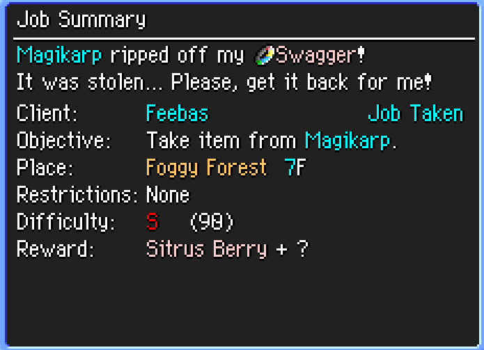
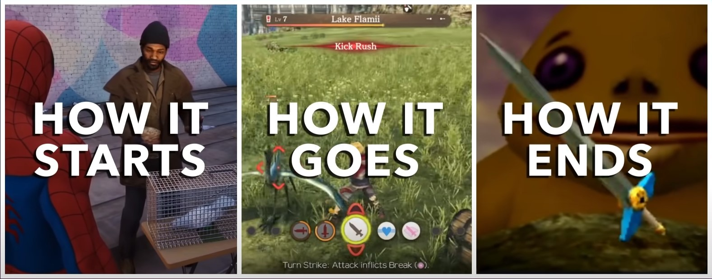

  
Contents

  <ol>
    <li>
      <a href="#information">Information</a>
    </li>
    <li>
      <a href="#introduction">Introduction</a>
    </li>
    <li>
      <a href="#types-of-sidequests-and-missions">Types of Sidequests and Missions</a>
    </li>
    <li>
      <a href="#how-to-make-a-sidequest-and-mission">How to make a Sidequest and Mission</a>
    </li>
    <li>
      <a href="#list-of-tips-on-how-to-make-a-sidequest-and-mission">List of Tips on how to make a Sidequest and Mission</a>
    </li>
    <li>
      <a href="#industry-example-persona-5">Industry example: Persona 5 Royal</a>
    </li>
    <li>
      <a href="#industry-example-the-witcher-3-wild-hunt">Industry example: The Witcher 3 Wild Hunt</a>
    </li>
    <li>
      <a href="#references">References</a>
    </li>
  </ol>

## Information

Slides presentation: [Presentation](https://docs.google.com/presentation/d/1DS_jOV3rhpEQI--hMgc4SqFk864yMV44DNsYdSd-JRM/edit?usp=sharing)

Project Link: [https://github.com/xGauss05/QuestsAndMissions](https://github.com/xGauss05/QuestsAndMissions)

Linkedin: [Jonathan Cacay Llanes](https://www.linkedin.com/in/jonathan-cacay-llanes-15982716b/)

## Introduction
I am Jonathan Cacay Llanes and by the time I created this github page, I was a 2nd year student in Universitat Politécnica de Catalunya, studying Videogame Design & Development. On this website you will find useful information on how to create your own missions for you RPG game.

If you are a fan of videogames, you should already know what side quests are. Otherwise, if you do not, sidequests are those tasks that we must fulfill for a specific purpose, but not being part, at least directly, of our main objective. This can increase the volume of a game, but when done effectively, it can also add interest to the main plot.

Sidequests are popular in RPG games, specially those with an open-world, but not only that genre has them.

## Types of Sidequests and Missions
There are several kinds of side quests. As many as the imagination allows. I will include the most essential ones here.

* Fetch Quests: require the player to collect a requested item
* Kill Quests: the player must kill a certain individual, typically being the target a monster
* Escort Quests: the player must take the requesting NPC (or another person) from point A to point B.
Typically, this form of mission involves the NPC joining temporarily as a guest party member in RPG games.
* Delivery Quests: the player must deliver an item given by the requesting NPC to another NPC.
* Push The Button Quests: activate a lever, magic stone, button. Usually this type of quests are a transition to bigger side quests.
* Mystery Quests: a mystery script, a riddle, all found by the player where he will need to decypher them in order to finish this quest.
* Lore Quests: a series of quests that explain a part of the story or world where the player character is involved

Try to make different combinations with the aftermentioned types of sidequests and missions. The more variety you combine, the greater the effect of volume will have on your game. For example, you can combine delivery, fetch and kill quests. 

### An example in Pokemon Mystery Dungeon Explorers of Time/Darkness/Sky

In this game, some jobs require the player to beat an Outlaw Pokémon and reclaim a stolen item.
The player must beat an outlaw Pokémon on the designated floor in this task.

After beating the Pokémon and reclaiming the stolen item, the player can return to the Guild to receive prizes for completing the sidequest.

#### Types of quest involved
>Fetch: Retrieve Swagger.
>
>Kill: Defeat Magikarp.
>
>Deliver: Deliver Swagger to Feebas.

## How to make a Sidequest and Mission

We need to make sure that we have these 3 steps on our hand:

* **How it starts**: a way to branch off the main story line, such as convenience. To summarize, find a way to hook the player to make the sidequest.
* **How it goes**: what are you supposed to do on the side quest. How it goes can contribute on the main story later on. This can have infinite possibilities.
* **How it ends**: the rewards that the sidequest is supposed to give to the player depends on every game world, give out loot, upgrades, etc.

In challenge driven sidequests, avoid giving the best gear right at the endgame, since it will not have content to use the gear later on.
In story driven sidequests, try to make these quests be an add-on for the main storyline.

## List of Tips on how to make a Sidequest and Mission
Side quests are short duration missions that enhance the immersion of the video game. These quests should be interesting and fun. Here are some of the steps that one should follow in order to design a side quest.

* **Make it meaningful**:
A side quest should have a purpose that is relevant to the game world or the main storyline. It should not feel like a random task that has no impact on the game. This can include providing additional lore, introducing new characters, or revealing about the game's world.
* **Give it variety**:
They should not feel all the same. Incorporate different types of gameplay, such as puzzle solving, combat, exploration, or social interactions, to keep the experience fresh and interesting.
* **Provide a clear objective**:
Make sure that the players understand what they need to do. Provide clear instructions on how to finish the quest.
* **Create challenges**:
Some interesting quests offer challenges that are difficult enough to keep players engaged for a couple hours, even months, but not so hard that they become frustrated. This can include difficult enemies, puzzles or time limits.
Create a variety of difficulty in these challenges so that different people can challenge themselves and test their prowess in the game. 
* **Balance the difficulty**:
Ensure that the side quest is balanced in terms of difficulty. It should be challenging enough to be engaging but not so difficult that players become frustrated and give up.
* **Offer rewards**:
Players should feel rewarded for completing a side quest. Rewards can include unique items, equipment, experience points, or other bonuses that enhance the player's character or improve their gameplay experience. Even a simple
skin for the player's weapon is good enough as a reward.
* **Make it optional**:
Side quests are meant to be optional, meaning that the player can either do them or not. This provides freedom to explore the game world at their own pace and pursue different goals.
* **Make it immersive**:
Create an engaging and immersive storyline that can complement the main story or not. This will keep the player invested in the experience. Use dialogue, cutscenes, and other storytelling techniques that can help you create
a good narrative that attracts players into the game world.
* **Use them to flesh out characters**:
Create a good narrative quest involving one of the protagonists that reveals more about their background, personality and motivations, giving players a deeper understanding of the characters that the player is controlling.
* **Make them discoverable**:
Ensure that these side quest can be found during exploration or by talking to NPCs. This encourages players to interact more with the game world.
* **Add player choices**:
Choices that affect the outcome of the side quest. This can add replayability and make the player feel like their choices ma tter.
* **Create a sense of urgency**:
You can make time-limited missions that needs to be completed before the time ends. This will give the sense of urgency or importance that makes players feel like they need to complete it as soon as possible. 
This can create tension and keep players engaged in the game world. But be careful, do not abuse them since having this type of quests can be frustrating when the game does not warn you that some missions can expire.
* **Use the environment**: 
Incorporate the game's environment into the side quest design. Use the terrain, weather, and other environmental factors to create unique challenges for players.
* **Make it non-linear**: 
Give players the freedom to complete the side quest in different ways. Offer multiple paths or solutions to the quest so that players can approach it in a way that suits their playstyle.
* **Make it thematically consistent**: 
Ensure that the side quest fits thematically with the rest of the game. It should not feel out of place or disconnected from the game world.
* **Create a sense of continuity**: 
Make the side quest feel like it is part of a larger story or narrative. Tie it into the main story or other side quests to create a sense of continuity in the game world.
* **Showcase game mechanics**: 
Side quests can be a great way to showcase different game mechanics. Create quests that require players to use different skills or abilities, helping them to learn and master different gameplay mechanics.
* **Create memorable characters**: 
Create memorable characters for players to interact with during side quests. Use unique personalities, dialogue, and actions to create characters that players will remember long after the side quest is over.
* **Make side quests repeatable**: 
Consider making side quests repeatable, allowing players to complete them multiple times for additional rewards or to improve their score.
* **Use humor**: 
Create a lighthearted and fun experience for players. This can include witty dialogue, humorous situations, or quirky characters.
* **Reward exploration**: 
Create side quests that reward exploration of the game world. This can include hidden areas, secret items, or unique encounters that are only accessible through exploration.

There are an unlimited number of tips to choose from in order to create a good experience on a sidequest. You should have no trouble making them as long as they make sense in the universe you are building and are balanced.

## Industry example: Persona 5

In Persona 5, the "Money-Grubbing Uncle" side quest involves a character named Futaba and his adoptive father Sojiro. In this quest, the player decided to hang out with Sojiro and Futaba. Until a character appears in the scene.
He is Futaba's uncle, and from the looks of it, he is not happy at all of Sojiro being the adoptive father. And turns out that not only wants Futaba's custody, but also a money compensation by suing the main character.
In the game world, the protagonist has a mysterious power that allows him to change a person's heart in the cognitive world known as Mementos.

 ### Why is this sidequest well designed?
* Engaging characters: involves several engaging characters and well-developed characters, such as Sojiro, Futaba, her uncle and the main protagonist.
* Varied gameplay: they added choices that the player must decide in order to obtain points towards a game mechanic that involves the player's social confidants, and a combat against an enemy.
* Interesting rewards: they rewarded the player accordingly to the difficulty of the side quest.
* Fits thematically: the sidequest involves using social skills to solve a problem and help others (a major theme for Persona 5) 

## Industry example: The Witcher 3: Wild Hunt

## References:
**Youtube videos**
* https://www.youtube.com/watch?v=361xodDNHyM
* https://www.youtube.com/watch?v=yTJ_RjfhGVQ
* https://www.youtube.com/watch?v=HcCn4w5WkLM
* https://www.youtube.com/watch?v=f2gVLzWpw_k

**Internet articles**
* https://www.masterclass.com/articles/how-to-write-side-quests-for-video-games
* https://www.gamedeveloper.com/design/designing-side-quests-study-these-7-games-and-some-chris-avellone-pointers-
* https://www.masterthedungeon.com/guide-to-dnd-side-quests
* https://pressover.news/articulos/la-importancia-de-las-misiones-secundarias/
* https://halflinghobbies.com/5-steps-to-creating-epic-side-quests/
* https://www.gameinformer.com/b/features/archive/2017/02/09/side-quest-syndrome-designing-the-road-less-travelled.aspx

**Reddit posts**
* https://www.reddit.com/r/truegaming/comments/12yjdd/time_limitations_on_missions/
* https://www.reddit.com/r/Games/comments/dxvi3h/what_kind_of_side_quests_in_are_the_best_in_rpgs/

**Slides presentation**
* https://docs.google.com/presentation/d/1DS_jOV3rhpEQI--hMgc4SqFk864yMV44DNsYdSd-JRM/edit?usp=sharing
